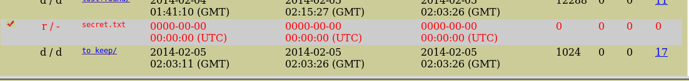
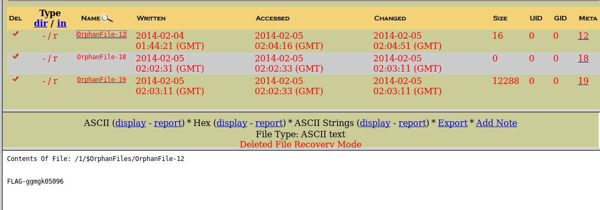

# I made a dd of Agent Smith usb key

The challange provide an image file :

> 86b265d37d1fc10b721a2accae04a60d

mounting the image results nothing, the flag might be deleted before,
firing up autopsy, make a case from the image file.

there's a file deleted from the root directory, try to find it in the orphan directory.

whup, there you go
> FLAG-ggmgk05096